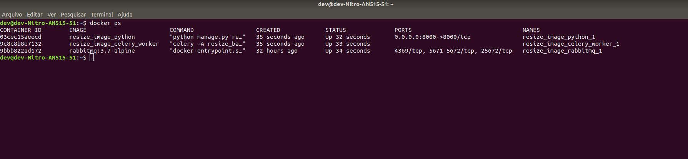
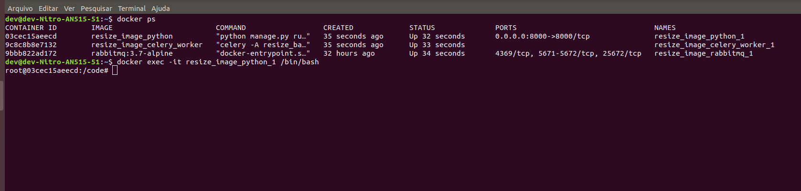
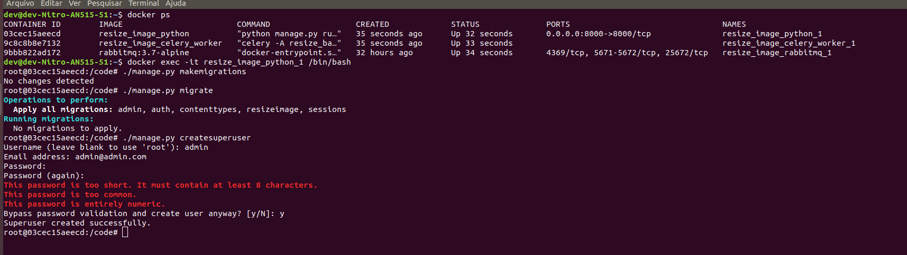

# resize_image
 Project to upload images and resize.


## Como instalar?
Precisamos fazer o download do nosso código fonte, digite:
```shell
git clone https://github.com/gilvanti/resize_image.git
```
O app está em docker quanto a dependencias não se preocupe, porem precisamos configurar configurar nossa maquina, para executar. Segue abaixo link que utilizei para configurar meu computador, utilizo o ubuntu 18.04.

https://www.hostinger.com.br/tutoriais/install-docker-ubuntu

Outro procedimento que realizei é configurar seu usuário para executar os comando docker, para evitar está usando o sudo a todo comando, se você não tem problema com isto pode pular esta etapa.

https://luizsouza.com.br/2018/11/01/docker-sem-sudo-no-ubuntu-18-04/

Após estás etapas vamos gerar nossas imagens docker, pois temos um app que se comunica com um worker celery e um broker rabbitmq, vá até a raiz do diretório criado ao fazer o clone do projeto e execute o comando abaixo:
```shell
docker-compose up
```

Agora vamos verificar se os conteiner estão ativo, execute o seguinte comando:
```shell
docker ps
```

Voce terá um retorno parecido com isto:



Agora vamos acessar o conteiner para executar as migrações:
```shell
docker exec -it resize_image_python_1 /bin/bash
```

Voce terá um retorno parecido com isto:



Observe que pegamos apenas o connteiner de nome "resize_image_python_1", pois é nele onde iremos gerar as migrações. Após estarmos dentro do conteiner iremos executar 3 etapas descritas abaixo:
```shell
./manage.py makemigratons
./manage.py migrate
./manage.py ceratesuperuser
```

Voce terá um retorno parecido com isto:



Quando ao criar o usuário será solicitado login, email e senha. Após isto podemos acessar o http://localhost:8000 e começar a utilizar o app.
